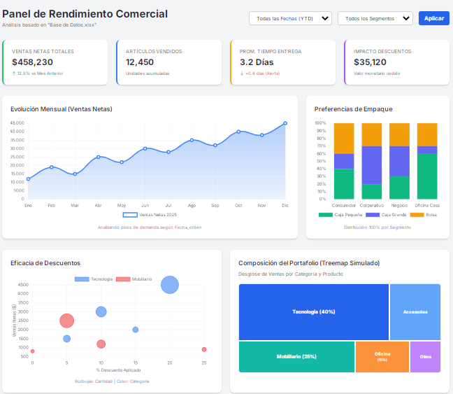
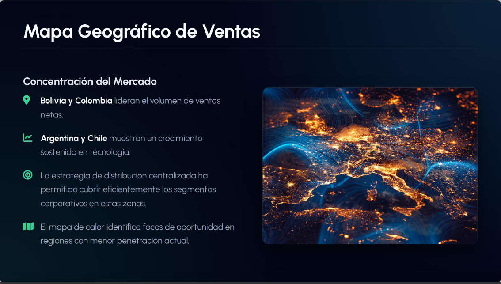
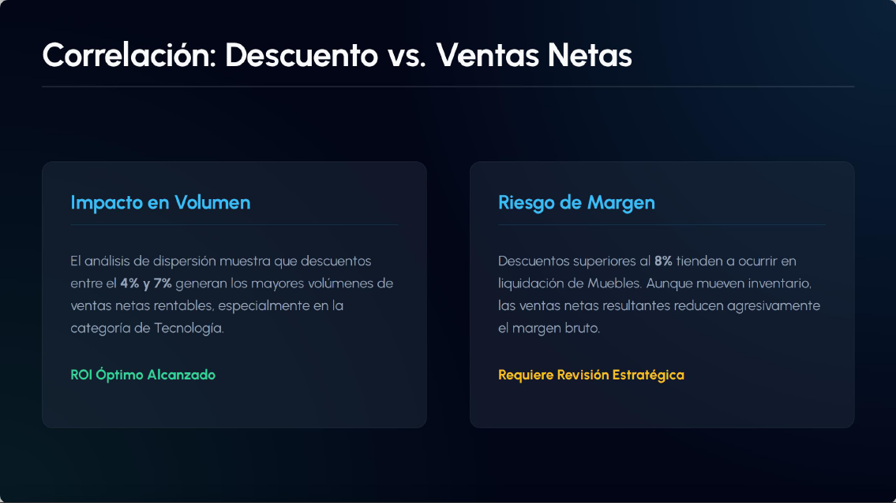
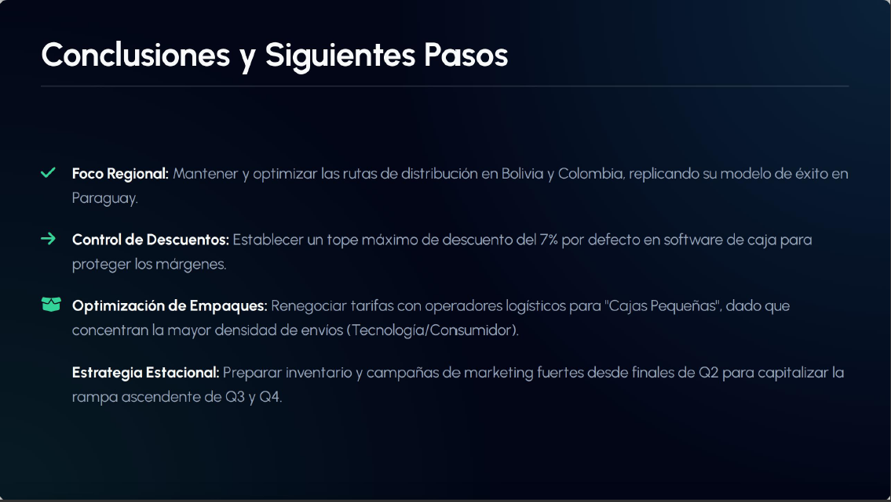

# Análisis Asistido por IA 

## 📊 Dashboard de Ventas + Analisis Complementado con Gemini

Este proyecto consiste basicamente en tomar unos datos provenientes de ventas
clasificados por categoria, region, segmentos, empaque, etc
Luego proceder a analisis asistido por Gemini, para determinar KPIs mas relevantes, graficos mas adecuados
Finalmente generar a un Dashboard para llegar conclusiones, observaciones e identificar patrones y correlaciones
que nos permitan comunicar insights valiosos a la sector correspondiente dentro del una empresa.

## 🖼️ Vista previa

## 🚀 Tecnologías
- Microsoft Excel
- Power Point + PDF
- Gemini IA

##### 👨‍💻 Author
##### Gabriel Gallardo
🔗 [LinkedIn Profile](https://www.linkedin.com/in/gerardo-gabriel-gallardo-12619ab5)
